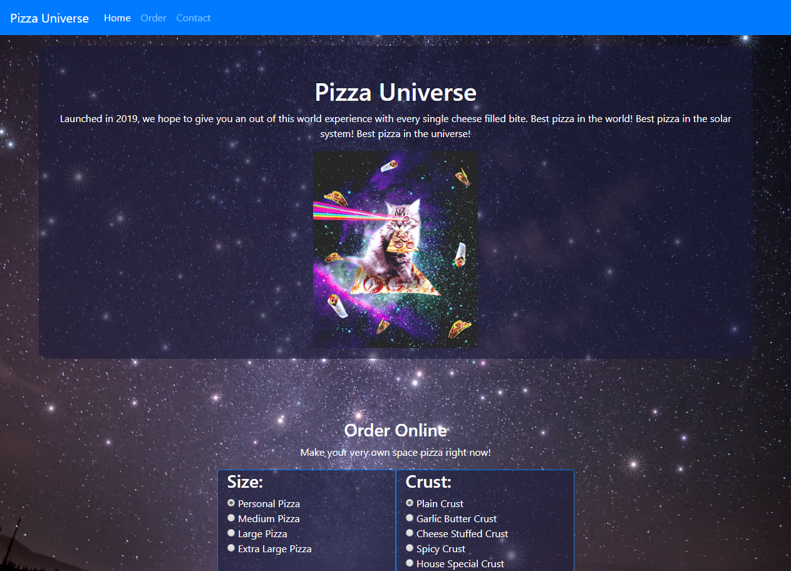

# Javascript Project
In this project, I sought to create a pizza ordering menu for a fictitious restaurant. Users are able to customise the ingredients they want on their pizza. THe total that the user owes is then calculated and rendered on the page. 

